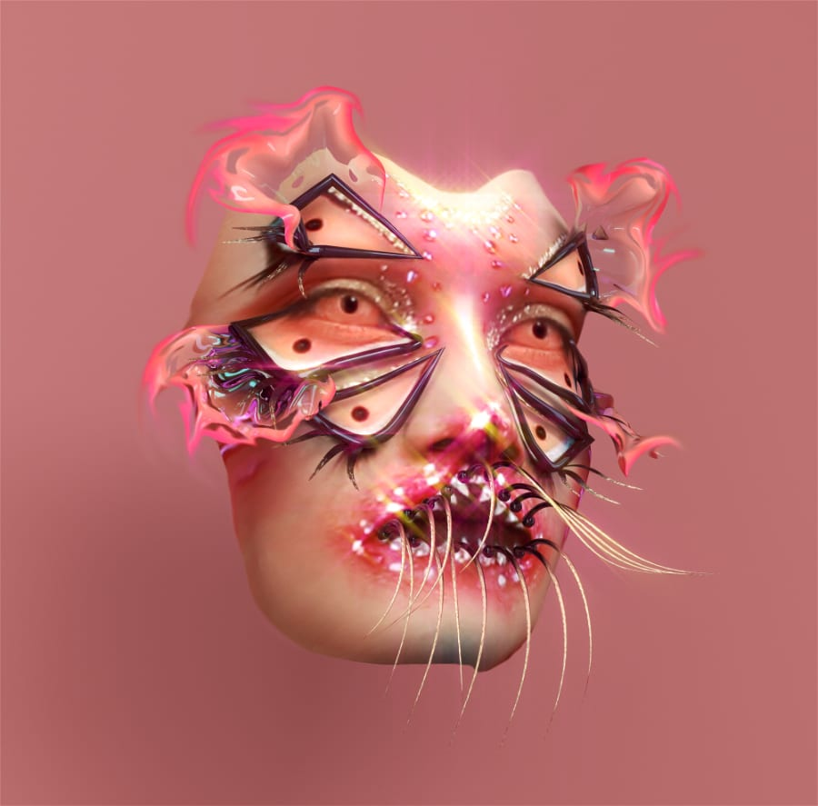
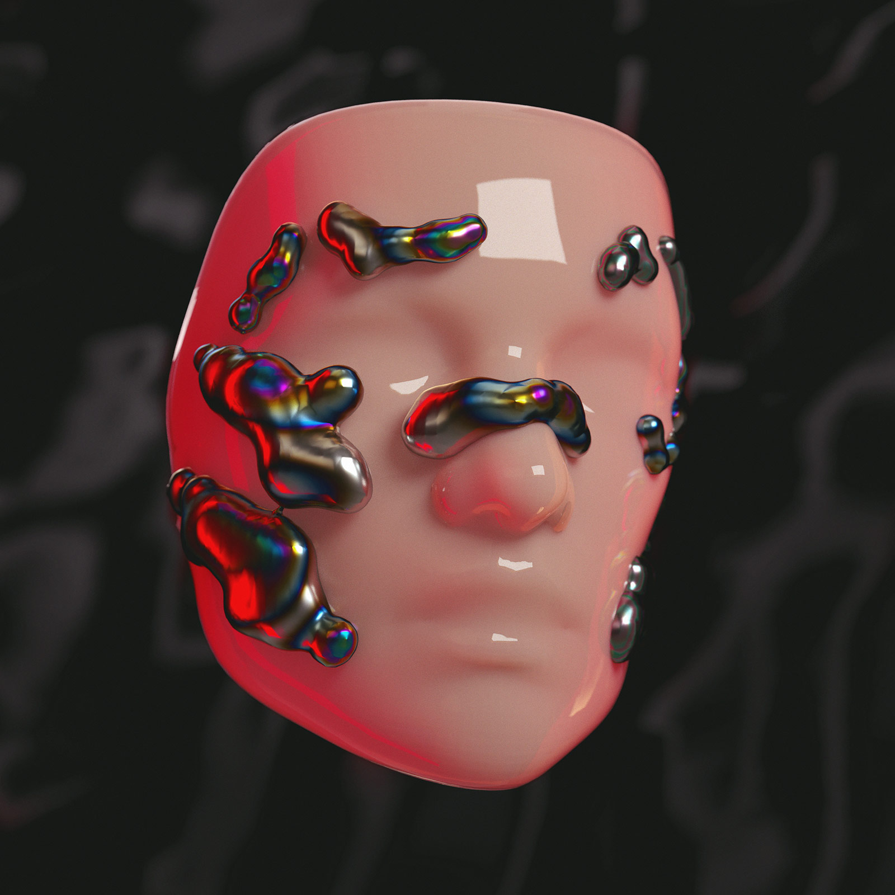
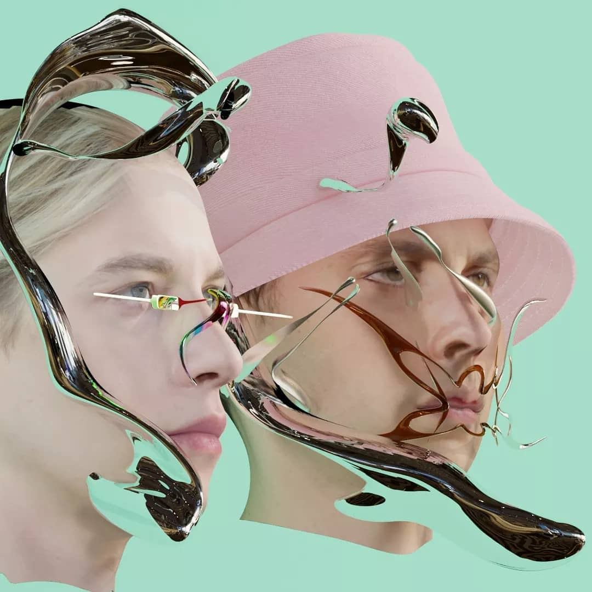
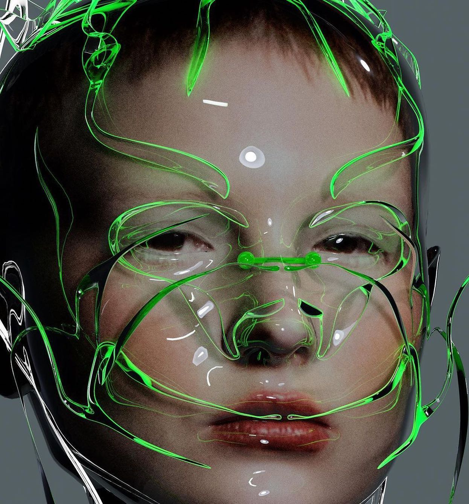
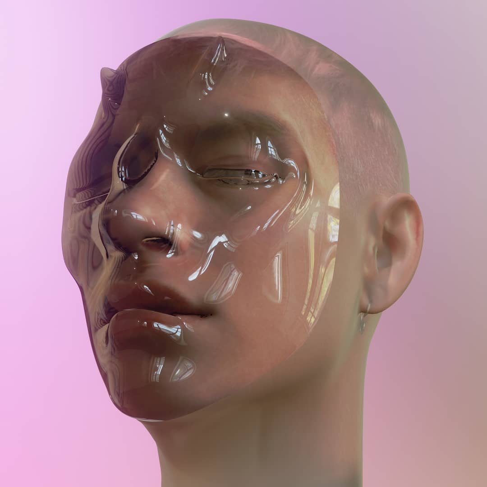

# PEC3: Visionant el futur amb les ulleres de Manovich 

### Recurs d'aprenentatge de Cultura Digital

Autor: Gemma de la Huerta

Fecha: 22/12/22

 

## La hibridació segons Manovich

El concepte d'**hibridació** dels mitjans és la característica fonamental dels nous mitjans tal com els entenem en l'actualitat, condició que es comença a desplegar a partir de finals dels anys setanta en una segona etapa de l'evolució de l'ordinador com a **metamitjà**.

Aquest fenomen s'explica per un procés de ***softwarització*** creixent dels mitjans i les **noves tècniques** d'edició i manipulació generades, que permeten superar les materialitats i fisicitats específiques dels mitjans tradicionals i possibiliten **combinacions** que abans no eren possibles. 

A conseqüència d'aquesta **interrelació** alliberada entre **mitjans simulats** i **mitjans nous**, es conforma un <u>nou paradigma</u> dels mitjans: la **interacció**, **mutació** i **fabricació** d'híbrids com a *continuum* de derivacions i **hibridacions infinites**. 

D'aquestes hibridacions, algunes es perdran, altres perduraran en el temps i algunes arribaran a consolidar-se de tal manera que la qualitat híbrida quedarà dissolta en el nou mitjà i aquest no podrà ser descompost en altres mitjans. 

L'evolució experimentada en els darrers anys en el marc de la cultura digital va en la línia de pensament anticipada per Manovich en la seva pròspera visió dels nous mitjans. 

Per tal d'il·lustrar les noves vies d'hibridació, analitzarem dues tendències actuals en l'àmbit de les instal·lacions interactives i l'art digital: 

- ==bioart==
- ==face filters== 

> Els projectes de bioart resulten especialment estimulants per tractar-se de casos doblement híbrids que treballen allà on es difumina la dualitat *natura vs cultura*

## OOZE de Theresa Schubert i Ivan Taranin 

Instal·lació biotecnològica que genera un ecosistema híbrid com a metàfora de la interrelació indestriable entre natura, cultura i tecnologia.

| La peça central de la instal·lació és una escultura biològica d'algues microscòpiques  monitorades en temps real per diferents sensors per tal de generar imatges i sons en directe. |  |  |
| ------------------------------------------------------------ | ------------------------------------------------------------ | ------------------------------------------------------------ |

A les parets de la sala s'hi projecten les imatges generades a partir de núvols de punts procedents de l'escaneig làser 3D de dues infraestructures conceptualment contraposades: un bosc com a *natura* i una granja de servidors com a *tecnologia*.

|  |      |  |
| ------------------------------------------------------------ | ---- | ------------------------------------------------------------ |

Els espectadors poden interaccionar amb el bioreactor que conté les algues microscòpiques mitjançant la llum dels seus dispositius mòbils, que les ajuda a créixer i a produir més oxigen. L'activitat de les algues modifica i anima els núvols de punts que condiciona l'atmosfera de la instal·lació.

| La instal·lació interactiva esdevé una metàfora de la dissolució del digital i del natural, l'un en l'altre, i amb l'alteració provocada per la presència humana que deixa traces i introdueix soroll en el sistema. |      |  |
| ------------------------------------------------------------ | ---- | ------------------------------------------------------------ |

> Els filtres 3D de realitat augmentada proporcionen mecanismes d'expressió i distorsió que treballen en l'exploració de la identitat i la *self-expression*

## AR face filters: Ines Alpha i Sarah Mayer

Els filtres 3D de realitat augmentada alberguen petites joies d'artistes digitals, com les creacions d'Ines Alpha i Sarah Mayer, en una nova disciplina emergent anomenada maquillatge 3D.

Aquests filtres utilitzen un sistema de seguiment en temps real de diferents punts d'ancoratge clau de la cara per projectar sobre l'usuari màscares estilitzades d'estètica futurista, fantàstica i/o surrealista amb formes orgàniques i geomètriques animades, a manera de pintura o escultura digital interactiva perfectament integrada que es poden capturar i guardar.

|  |  |  |
| ----------------------------------------------------------- | :----------------------------------------------------------: | ------------------------------------------------------------ |
|                                                             |                                                              |                                                              |
|                                                             |                   Filtres 3D d'Ines Alpha                    |                                                              |

Una de les propietats més interessants dels filtres AR és la possibilitat de generar composicions digitals complexes, combinant el retrat fotogràfic, el fotomuntatge i el disseny 3D, amb la facilitat i immediatesa de la fotografia instantània i obtenir resultats que abans només eren possibles després de processos avançats de retoc i tractament de la imatges. 

Els filtres de cara de realitat augmentada són tot un fenomen recent de les xarxes socials i acompanyen l'usuari en el procés d'expressió personal i exploració de la pròpia imatge que connecta amb la fluïdesa identitària i el qüestionament dels estàndards de bellesa en el context de les identitats digitals.

|  |  |  |
| :----------------------------------------------------------: | :----------------------------------------------------------: | ------------------------------------------------------------ |
|                                                              |                                                              |                                                              |
|                                                              |                  Filtres 3D de Sarah Mayer                   |                                                              |

### Referències y Bibliografia

* Manovich, Lev. (2013). **El Software toma el mando**. Barcelona: Editorial UOC. 

* Laboratoria Art&Science Foundation (2021). *OOZE*. Disponible a: https://laboratoria.art/en/ooze/

* Theresa Schubert (2021). *Works: Ooze. Disponible a: https://www.theresaschubert.com/works/ooze/

* Ritupriya Basu (2022). *How The Fantastical, Futuristic Art of AR Face Filters Is Subverting Traditional Notions of Beauty*. Disponible a:  https://www.ritupriyabasu.com/features/2022/3/4/how-the-fantastical-futuristic-art-of-ar-face-filters-is-subverting-traditional-notions-of-beauty

* Gráffica (2019). *El maquillaje 3D de Ines Alpha*. Disponible a: https://graffica.info/el-maquillaje-3d-de-ines-alpha/

* SuperRare Magazine (2022). *Beyond the self: a conversation with Ines Alpha*. Disponible a: https://superrare.com/magazine/2022/11/01/beyond-the-self-a-conversation-with-ines-alpha/

  ‌

----

Llicència: Material Creative Commons desenvolupat sota llicència CC BY-SA 4.0. Imatges de la instal·lació *Ooze*pertanyen a Yuri Palmin i Theresa Schubert. Imatges dels filtres 3D d'Ines Alpha i Sarah Mayer de les respectives autores. Les imatges poden estar subjectes a drets d'autor. Fotografia de portada de Black Salmon amb llicència Freepik Premium.
